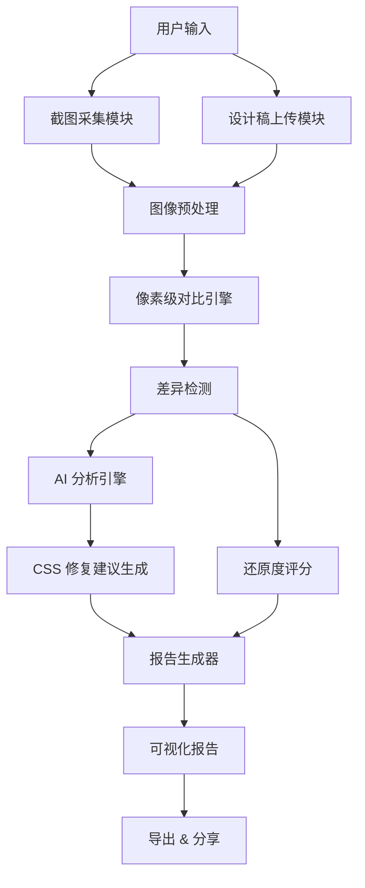
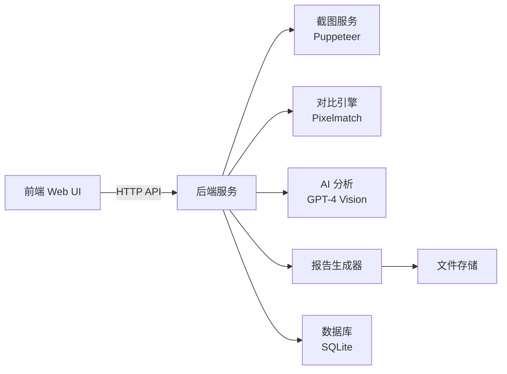
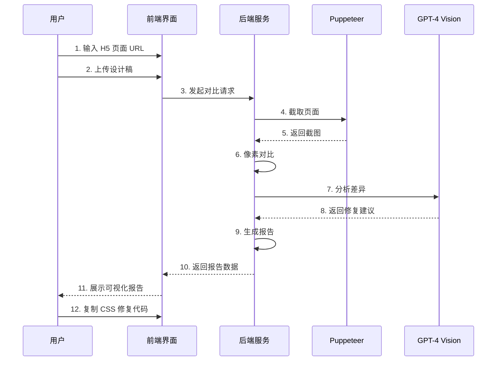

# UI-Eye 产品需求文档

## 📋 文档信息

| 项目名称 | UI-Eye（UI 之眼） |
|---------|------------------|
| 文档版本 | v1.0 |
| 创建日期 | 2026-01-12 |
| 负责人 | 待定 |
| 文档状态 | 草稿 - 待评审 |

---

## 🎯 项目概述

### 项目定位
UI-Eye 是一款 **AI 驱动的自动化视觉走查机器人**，专注于解决前端开发中 UI 还原度检查的痛点，通过像素级对比技术和 AI 智能分析，实现设计稿与实际页面的自动化对比，并生成可执行的修复建议。

### 核心价值主张
- **降本**：自动化替代人工走查，节省 80% UI 审核时间
- **增效**：AI 直接给出 CSS 修改建议，开发者一键修复
- **规范**：建立量化的还原度标准（如：还原度 > 95% 准予上线）

---

## 💡 业务背景

### 当前痛点

#### 1. 肉眼走查效率低
- **现状**：UI 走查依赖人工反复对比设计稿与实际页面
- **问题**：
  - 耗时长：一个页面平均需要 15-30 分钟
  - 易疲劳：长时间对比容易遗漏细节
  - 重复性高：每次迭代都需要重新走查

#### 2. 还原度难以量化
- **现状**："像不像"全凭主观感觉
- **问题**：
  - 缺乏客观标准：不同审核人员标准不一
  - 无法追溯：历史还原度数据无法沉淀
  - 难以改进：无法量化优化效果

#### 3. 反馈链路冗长
- **现状**：发现问题 → 截图 → 标注 → 反馈开发 → 修复 → 再次走查
- **问题**：
  - 沟通成本高：需要多次来回确认
  - 修复不精准：开发者凭感觉调整 CSS
  - 周期长：一轮反馈修复需要 1-2 天

### 目标用户

| 用户角色 | 使用场景 | 核心诉求 |
|---------|---------|---------|
| **UI 设计师** | 验收前端页面还原度 | 快速发现还原问题，减少人工走查时间 |
| **前端开发** | 自查 UI 还原质量 | 获取精准的 CSS 修复建议，提升还原准确度 |
| **测试工程师** | UI 回归测试 | 自动化对比历史版本，发现 UI 退化问题 |
| **项目经理** | 质量把控与验收 | 量化还原度指标，建立上线标准 |

---

## 🎨 功能需求

### 功能架构图



### 核心功能模块

#### 1. 截图采集模块

**功能描述**：自动采集 H5 页面的完整截图

**详细需求**：

| 功能点 | 优先级 | 详细说明 |
|-------|--------|---------|
| URL 输入 | P0 | 支持输入任意 H5 页面 URL |
| 全页截图 | P0 | 支持长页面滚动截图（非首屏） |
| 视口配置 | P1 | 支持自定义视口尺寸（375x667, 414x896 等） |
| 设备模拟 | P1 | 模拟移动设备 User-Agent 和触摸事件 |
| 等待加载 | P0 | 智能等待页面资源加载完成（图片、字体等） |
| 交互状态 | P2 | 支持捕获 hover、focus 等交互状态 |
| 批量截图 | P2 | 支持一次性截取多个页面 |

**输入示例**：
```json
{
  "url": "https://example.com/page.html",
  "viewport": {
    "width": 375,
    "height": 667
  },
  "waitUntil": "networkidle0",
  "fullPage": true
}
```

**输出**：PNG 格式的页面截图

---

#### 2. 设计稿管理模块

**功能描述**：支持两种设计稿对比模式，满足不同使用场景

**详细需求**：

| 功能点 | 优先级 | 详细说明 |
|-------|--------|---------|
| **模式一：效果图上传** | P0 | 支持拖拽上传 PNG/JPG 格式设计稿 |
| 文件预览 | P0 | 上传后实时预览设计稿内容 |
| 尺寸校验 | P1 | 自动检测设计稿尺寸，提示与页面尺寸不匹配 |
| **模式二：蓝湖地址对比** | P0 | 输入蓝湖设计稿链接，自动获取设计图 |
| 蓝湖 API 集成 | P0 | 通过蓝湖 API 获取设计稿高清图片 |
| 多画板支持 | P1 | 支持选择蓝湖项目中的具体画板 |
| 历史记录 | P1 | 保存历史上传/使用的设计稿，支持快速复用 |
| 模式切换 | P0 | 用户可自由切换两种对比模式 |

**蓝湖集成方案**：
```javascript
// 蓝湖 API 调用示例
const lanhuConfig = {
  apiEndpoint: 'https://lanhuapp.com/api/v1',
  projectId: 'xxx',
  artboardId: 'xxx',
  token: process.env.LANHU_API_TOKEN
};

// 获取设计稿图片
async function fetchLanhuDesign(url) {
  // 解析蓝湖链接，提取项目 ID 和画板 ID
  // 调用蓝湖 API 获取高清设计图
  // 返回图片 URL 或 Buffer
}
```

---

#### 3. 像素级对比引擎

**功能描述**：对设计稿与实际页面进行像素级对比，生成差异图

**详细需求**：

| 功能点 | 优先级 | 详细说明 |
|-------|--------|---------|
| 图像对齐 | P0 | 自动对齐两张图片（处理尺寸差异） |
| 像素对比 | P0 | 逐像素对比，检测颜色、位置差异 |
| 差异高亮 | P0 | 生成差异图，用红色标注不同区域 |
| 相似度评分 | P0 | 计算整体相似度（0-100%） |
| 容差配置 | P1 | 支持设置颜色容差（如：RGB ±5 视为相同） |
| 区域忽略 | P2 | 支持手动标注忽略区域（如：动态内容、广告位） |
| 分区对比 | P2 | 按模块分区对比（头部、内容区、底部等） |

**算法选型**：
- **Pixelmatch**：轻量级像素对比库，适合 Web 环境
- **备选**：SSIM（结构相似性）算法，更符合人眼感知

**输出示例**：
```json
{
  "similarity": 92.5,
  "diffPixels": 12450,
  "totalPixels": 165000,
  "diffImageUrl": "/reports/diff_12345.png"
}
```

---

#### 4. AI 分析引擎

**功能描述**：基于多种视觉大模型，智能分析差异原因并生成 CSS 修复建议，支持内外网环境灵活切换

**详细需求**：

| 功能点 | 优先级 | 详细说明 |
|-------|--------|---------|
| **大模型切换** | P0 | 支持在内网和外网环境切换不同大模型 |
| 多模型支持 | P0 | 支持千问 2.5、GPT-4 Vision、Claude 等多种模型 |
| 配置管理 | P0 | 通过配置文件或界面切换模型 |
| 差异分类 | P0 | 自动识别差异类型（颜色、字体、间距、布局等） |
| CSS 提取 | P0 | 从差异中提取对应的 CSS 属性 |
| 修复建议 | P0 | 生成具体的 CSS 修复代码 |
| 优先级排序 | P1 | 按视觉影响程度排序修复建议（高/中/低） |
| 批量修复 | P2 | 生成批量修复脚本（一键应用所有建议） |
| 中文输出 | P0 | 所有分析结果和建议均为中文描述 |

**技术方案**：

### 多大模型架构设计

采用**策略模式**设计，支持多种大模型无缝切换：

```javascript
// AI 模型配置
const AI_MODELS = {
  // 内网环境 - 千问 2.5
  QWEN_INTERNAL: {
    name: '千问 2.5（内网）',
    provider: 'qwen',
    endpoint: process.env.QWEN_API_ENDPOINT || 'http://internal-qwen-api.company.com/v1',
    model: 'qwen-vl-plus',
    apiKey: process.env.QWEN_API_TOKEN,
    environment: 'internal'
  },
  
  // 外网环境 - GPT-4 Vision
  GPT4_EXTERNAL: {
    name: 'GPT-4 Vision（外网）',
    provider: 'openai',
    endpoint: 'https://api.openai.com/v1',
    model: 'gpt-4-vision-preview',
    apiKey: process.env.OPENAI_API_KEY,
    environment: 'external'
  },
  
  // 外网环境 - Claude 3
  CLAUDE_EXTERNAL: {
    name: 'Claude 3 Opus（外网）',
    provider: 'anthropic',
    endpoint: 'https://api.anthropic.com/v1',
    model: 'claude-3-opus-20240229',
    apiKey: process.env.ANTHROPIC_API_KEY,
    environment: 'external'
  }
};

// 模型选择器
class AIModelSelector {
  constructor() {
    this.currentModel = this.detectEnvironment();
  }
  
  // 自动检测网络环境
  detectEnvironment() {
    // 尝试访问内网 API，如果可达则使用内网模型
    // 否则使用外网模型
    return AI_MODELS.QWEN_INTERNAL;
  }
  
  // 手动切换模型
  switchModel(modelKey) {
    this.currentModel = AI_MODELS[modelKey];
  }
  
  // 获取当前模型
  getCurrentModel() {
    return this.currentModel;
  }
}
```

### 方案一：千问 2.5（内网私有化部署）

**适用场景**：公司内网环境，数据安全要求高

**优势**：
- 公司私有化部署，数据安全有保障
- 无外部 API 调用成本
- 支持中文场景，理解能力强
- 视觉理解能力优秀，适合 UI 对比分析

**实现方式**：
```javascript
// 千问 2.5 API 调用
async function analyzeWithQwen(designImage, actualImage, diffImage) {
  const response = await fetch(`${AI_MODELS.QWEN_INTERNAL.endpoint}/chat/completions`, {
    method: 'POST',
    headers: {
      'Content-Type': 'application/json',
      'Authorization': `Bearer ${AI_MODELS.QWEN_INTERNAL.apiKey}`
    },
    body: JSON.stringify({
      model: AI_MODELS.QWEN_INTERNAL.model,
      messages: [{
        role: 'user',
        content: [
          {
            type: 'text',
            text: `你是一个专业的前端 UI 审查专家。请对比以下三张图片：
            1. 设计稿（标准）
            2. 实际页面截图
            3. 差异标注图
            
            请分析：
            1. 列出所有视觉差异点（颜色、字体、间距、布局等）
            2. 对每个差异点给出具体的 CSS 修复建议
            3. 按视觉影响程度排序（高/中/低优先级）
            
            输出格式为 JSON：
            {
              "fixes": [
                {
                  "priority": "high|medium|low",
                  "type": "color|font|spacing|layout",
                  "description": "差异描述",
                  "selector": "CSS 选择器",
                  "currentCSS": "当前样式",
                  "suggestedCSS": "建议样式",
                  "impact": "影响说明"
                }
              ]
            }`
          },
          { type: 'image_url', image_url: designImage },
          { type: 'image_url', image_url: actualImage },
          { type: 'image_url', image_url: diffImage }
        ]
      }]
    })
  });
  
  return response.json();
}
```

### 方案二：GPT-4 Vision（外网）

**适用场景**：外网环境，或需要更强的视觉理解能力

**优势**：
- 视觉理解能力业界领先
- 多语言支持好
- 生态成熟，文档完善

**实现方式**：
```javascript
// GPT-4 Vision API 调用
async function analyzeWithGPT4(designImage, actualImage, diffImage) {
  const response = await fetch(`${AI_MODELS.GPT4_EXTERNAL.endpoint}/chat/completions`, {
    method: 'POST',
    headers: {
      'Content-Type': 'application/json',
      'Authorization': `Bearer ${AI_MODELS.GPT4_EXTERNAL.apiKey}`
    },
    body: JSON.stringify({
      model: AI_MODELS.GPT4_EXTERNAL.model,
      messages: [{
        role: 'user',
        content: [
          {
            type: 'text',
            text: '你是专业的前端 UI 审查专家...'  // 同上 Prompt
          },
          { type: 'image_url', image_url: { url: designImage } },
          { type: 'image_url', image_url: { url: actualImage } },
          { type: 'image_url', image_url: { url: diffImage } }
        ]
      }],
      max_tokens: 4096
    })
  });
  
  return response.json();
}
```

### 统一调用接口

```javascript
// AI 分析统一入口
async function analyzeUIComparison(designImage, actualImage, diffImage, modelKey = null) {
  const selector = new AIModelSelector();
  
  // 如果指定了模型，则使用指定模型
  if (modelKey) {
    selector.switchModel(modelKey);
  }
  
  const model = selector.getCurrentModel();
  
  // 根据不同的 provider 调用对应的 API
  switch (model.provider) {
    case 'qwen':
      return await analyzeWithQwen(designImage, actualImage, diffImage);
    case 'openai':
      return await analyzeWithGPT4(designImage, actualImage, diffImage);
    case 'anthropic':
      return await analyzeWithClaude(designImage, actualImage, diffImage);
    default:
      throw new Error(`不支持的模型提供商: ${model.provider}`);
  }
}
```

### 前端配置界面

在用户界面提供模型切换选项：

```javascript
// 模型选择组件
<select v-model="selectedModel">
  <option value="QWEN_INTERNAL">千问 2.5（内网）</option>
  <option value="GPT4_EXTERNAL">GPT-4 Vision（外网）</option>
  <option value="CLAUDE_EXTERNAL">Claude 3（外网）</option>
</select>
```

**Prompt 优化策略**：
- 提供明确的角色定位（前端 UI 审查专家）
- 给出结构化的输出格式要求（JSON）
- 强调中文输出和具体可执行的建议
- 包含优先级排序逻辑
- 所有模型使用统一的 Prompt 模板，确保输出一致性

**输出示例**：
```json
{
  "fixes": [
    {
      "priority": "high",
      "type": "color",
      "description": "标题颜色不一致",
      "selector": ".title",
      "currentCSS": "color: #333333;",
      "suggestedCSS": "color: #000000;",
      "impact": "视觉差异明显，建议优先修复"
    },
    {
      "priority": "medium",
      "type": "spacing",
      "description": "按钮上边距偏小",
      "selector": ".btn-primary",
      "currentCSS": "margin-top: 10px;",
      "suggestedCSS": "margin-top: 16px;"
    }
  ]
}
```

---

#### 5. 报告生成与展示

**功能描述**：生成可视化的对比报告，支持交互式查看与导出

**详细需求**：

| 功能点 | 优先级 | 详细说明 |
|-------|--------|---------|
| 对比视图 | P0 | 左右并排展示设计稿与实际页面 |
| 滑动对比 | P0 | 拖动滑块切换两张图片（类似 Before/After） |
| 差异叠加 | P1 | 将差异图叠加在原图上，可调节透明度 |
| 还原度仪表盘 | P0 | 环形进度条展示还原度分数 |
| 修复建议列表 | P0 | 分类展示所有修复建议，支持一键复制代码 |
| 缩放与标注 | P1 | 支持放大查看细节，点击差异区域查看对应建议 |
| 导出报告 | P1 | 导出为 PDF 或 HTML 格式，便于分享 |
| 历史对比 | P2 | 查看历史对比记录，追踪还原度变化趋势 |

**报告结构**：
```
┌─────────────────────────────────────┐
│  UI-Eye 对比报告                     │
│  还原度：92.5% ✅                    │
├─────────────────────────────────────┤
│  [设计稿]  ←→  [实际页面]  ←→  [差异图] │
│  (滑动对比)                          │
├─────────────────────────────────────┤
│  修复建议 (3 项)                     │
│  🔴 高优先级 (1)                     │
│    - 标题颜色不一致                  │
│      [复制 CSS]                      │
│  🟡 中优先级 (2)                     │
│    - 按钮边距偏小                    │
│    - 字体大小差异                    │
└─────────────────────────────────────┘
```

---

### 功能优先级总结

| 优先级 | 功能模块 | 说明 |
|-------|---------|------|
| **P0** | 截图采集 + 像素对比 + 基础报告 | MVP 核心功能，必须实现 |
| **P1** | AI 分析 + 交互式报告 | 核心价值功能，显著提升用户体验 |
| **P2** | 蓝湖集成 + 批量处理 + 历史追踪 | 增强功能，后续迭代 |

---

## 🔧 技术方案

### 技术架构



### 技术栈选型

#### 前端
| 技术 | 版本 | 用途 | 选型理由 |
|-----|------|------|---------|
| **Vite** | 5.x | 构建工具 | 快速冷启动，HMR 体验好 |
| **Vue 3** | 3.x | UI 框架 | 组合式 API，响应式强 |
| **Vue Router** | 4.x | 路由管理 | 官方路由方案 |
| **Pinia** | 2.x | 状态管理 | 轻量级，TypeScript 友好 |
| **TailwindCSS** | 3.x | CSS 框架 | 快速构建现代 UI（可选） |

#### 后端
| 技术 | 版本 | 用途 | 选型理由 |
|-----|------|------|---------|
| **Node.js** | 18+ | 运行环境 | 前后端统一语言 |
| **Express** | 4.x | Web 框架 | 轻量级，生态成熟 |
| **Puppeteer** | 21.x | 无头浏览器 | 官方维护，稳定性高 |
| **Pixelmatch** | 5.x | 像素对比 | 轻量快速，适合 Web |
| **Sharp** | 0.33.x | 图像处理 | 高性能图像缩放、裁剪 |
| **Multer** | 1.x | 文件上传 | Express 官方推荐 |

#### AI 与数据
| 技术 | 版本 | 用途 | 选型理由 |
|-----|------|------|---------|
| **千问 2.5** | qwen-vl-plus | AI 视觉分析（内网） | 公司私有化部署，数据安全，中文能力强 |
| **GPT-4 Vision** | gpt-4-vision-preview | AI 视觉分析（外网） | 视觉理解能力强，多语言支持好 |
| **Claude 3** | claude-3-opus | AI 视觉分析（外网备选） | 视觉分析能力优秀，输出质量高 |
| **SQLite** | 3.x | 数据存储 | 轻量级，无需独立部署 |

> **说明**：支持多大模型切换，根据网络环境（内网/外网）自动选择或手动切换模型

### 关键技术决策

#### 1. 截图方案：Puppeteer vs Playwright
| 对比项 | Puppeteer | Playwright |
|-------|-----------|------------|
| 浏览器支持 | Chromium | Chromium/Firefox/WebKit |
| 性能 | 快 | 稍慢 |
| 生态成熟度 | 高 | 中 |
| **选择** | ✅ 选用 | - |

**决策**：选择 Puppeteer，因为项目主要针对移动端 H5，Chromium 覆盖已足够。

#### 2. AI 分析方案：多大模型支持

**架构设计**：采用策略模式，支持多种大模型无缝切换

| 对比项 | 千问 2.5（内网） | GPT-4 Vision（外网） | Claude 3（外网） |
|-------|----------------|-------------------|-----------------|
| 准确度 | 高 | 高 | 高 |
| 成本 | 无（内部部署） | 有调用费用 | 有调用费用 |
| 数据安全 | 高（内网） | 中（外部 API） | 中（外部 API） |
| 中文能力 | 强 | 中 | 中 |
| 响应速度 | 2-5s | 3-8s | 3-8s |
| 网络要求 | 内网可达 | 外网可达 | 外网可达 |

**决策**：
- **默认策略**：优先使用千问 2.5（内网），数据安全且中文理解能力强
- **切换机制**：
  - 自动检测：系统自动检测网络环境，内网优先使用千问 2.5
  - 手动切换：用户可在界面手动选择使用的大模型
  - 降级策略：如果首选模型不可用，自动切换到备用模型
- **扩展性**：架构支持轻松接入新的大模型（如文心一言、星火等）

#### 3. 前端 CSS 方案：Vanilla CSS vs TailwindCSS
**决策**：使用 **Vanilla CSS + CSS 变量**，原因：
- 更灵活的设计系统控制
- 避免 Tailwind 的类名冗长
- 更好的动画和渐变效果

---

## 👤 用户流程

### 主流程：UI 对比走查



### 详细操作步骤

#### 步骤 1：配置对比任务
1. 用户打开 UI-Eye 首页
2. 点击"新建对比"按钮
3. 选择对比模式：
   - **模式一：效果图上传**
   - **模式二：蓝湖地址对比**
4. 选择 AI 分析模型（可选，系统会自动检测）：
   - 千问 2.5（内网）
   - GPT-4 Vision（外网）
   - Claude 3（外网）
5. 填写表单：
   - 输入 H5 页面 URL
   - **模式一**：拖拽上传设计稿图片（PNG/JPG）
   - **模式二**：输入蓝湖设计稿链接（自动获取）
   - 选择视口尺寸（默认：375x667）
   - 设置对比选项（容差、忽略区域等）
6. 点击"开始对比"

#### 步骤 2：等待分析
1. 显示进度条：
   - 正在截取页面... (20%)
   - 正在对比图像... (50%)
   - AI 分析中... (80%)
   - 生成报告... (100%)
2. 预计耗时：15-30 秒

#### 步骤 3：查看报告
1. 自动跳转到报告页面
2. 查看还原度分数（环形进度条）
3. 使用滑动对比查看差异
4. 浏览修复建议列表
5. 点击建议项，查看详细说明和代码
6. 一键复制 CSS 代码

#### 步骤 4：修复与验证
1. 开发者复制 CSS 代码到项目中
2. 重新部署页面
3. 再次使用 UI-Eye 对比
4. 验证还原度是否提升

---

## 📊 非功能性需求

### 性能要求
| 指标 | 目标值 | 说明 |
|-----|--------|------|
| 页面截图时间 | < 10s | 普通 H5 页面 |
| 图像对比时间 | < 3s | 1080p 分辨率 |
| AI 分析时间 | < 5s | GPT-4 Vision API |
| 报告生成时间 | < 2s | 包含渲染 |
| **总耗时** | **< 30s** | 完整流程 |

### 可用性要求
- **浏览器兼容**：Chrome 90+, Safari 14+, Edge 90+
- **响应式设计**：支持桌面端（1920x1080）和平板端（1024x768）
- **错误处理**：网络失败、截图失败、AI 调用失败时，给出明确提示

### 安全性要求
- **数据隐私**：截图和设计稿仅存储 7 天，自动清理
- **API 密钥**：OpenAI API Key 通过环境变量配置，不暴露在前端
- **访问控制**：（可选）支持用户登录，隔离不同用户的数据

---

## 🚀 MVP 范围

### MVP 包含功能（v1.0）
✅ H5 页面截图（支持全页滚动截图）  
✅ **双模式设计稿对比**：
   - 模式一：效果图上传（拖拽上传 PNG/JPG）
   - 模式二：蓝湖地址对比（输入蓝湖链接自动获取）
✅ 像素级对比与差异图生成  
✅ 还原度评分（0-100%）  
✅ **多大模型 AI 分析**：
   - 支持千问 2.5（内网）、GPT-4 Vision（外网）、Claude 3（外网）
   - 自动检测网络环境，智能选择模型
   - 支持手动切换模型
✅ CSS 修复建议生成（中文输出）  
✅ 可视化报告（滑动对比 + 差异叠加 + 修复建议列表）  
✅ 一键复制 CSS 代码  
✅ 中文界面与中文分析结果  

### MVP 不包含功能（后续迭代）
❌ 批量对比多个页面  
❌ 历史记录与趋势分析  
❌ 用户登录与权限管理  
❌ 浏览器插件  
❌ 自动化 CI/CD 集成  
❌ 移动端 App  
❌ 更多大模型接入（文心一言、星火等）  

---

## 📅 开发计划

### 里程碑规划

| 阶段 | 时间 | 交付物 | 验收标准 |
|-----|------|--------|---------|
| **需求评审** | Week 1 | 本 PRD 文档 | 需求确认无歧义 |
| **技术方案设计** | Week 1 | 技术架构文档 | 技术选型确定 |
| **核心功能开发** | Week 2-3 | 截图 + 对比 + AI 分析 | 功能可用 |
| **UI 开发** | Week 3-4 | 前端界面 + 报告页 | 界面美观易用 |
| **联调测试** | Week 4 | 完整流程测试 | 端到端流程通畅 |
| **MVP 发布** | Week 5 | v1.0 版本 | 可对外演示 |

---

## ❓ 待确认问题

### 已确认 ✅

- ✅ **AI 方案**：支持多大模型切换（千问 2.5 + GPT-4 Vision + Claude 3）
- ✅ **蓝湖集成**：有 API 访问权限，需同时支持效果图上传和蓝湖地址两种模式
- ✅ **语言**：全中文界面和文档

### 待确认问题

> [!IMPORTANT]
> **需要进一步确认**

1. **千问 2.5 API 配置（内网）**
   - 私有化部署的 API 地址是什么？
   - 是否需要 Token 认证？
   - API 调用限制（QPS、并发数等）？
   - 支持的图片格式和大小限制？

2. **外网大模型配置**
   - 是否需要配置 OpenAI API Key（GPT-4 Vision）？
   - 是否需要配置 Anthropic API Key（Claude 3）？
   - 外网模型的调用成本预算是多少？
   - 是否需要设置调用频率限制？

3. **蓝湖 API 配置**
   - 蓝湖 API Token 如何获取？
   - 支持的蓝湖链接格式是什么？（如：`https://lanhuapp.com/web/#/item/project/...`）
   - 是否需要支持多个蓝湖账号？

4. **部署方式**
   - 本地部署（开发者自行运行）
   - 内网部署（公司内部服务器）
   - 云端部署（提供在线服务）

5. **数据存储**
   - 截图和报告保存时长？（建议 7 天自动清理）
   - 是否需要用户登录功能？
   - 是否需要团队协作功能？

6. **性能要求**
   - 预计并发用户数？
   - 单次对比的超时时间限制？
   - 不同模型的优先级策略？（如：优先使用千问，失败后切换到 GPT-4）

---

## 📝 附录

### 参考资料
- [Puppeteer 官方文档](https://pptr.dev/)
- [Pixelmatch GitHub](https://github.com/mapbox/pixelmatch)
- [OpenAI Vision API](https://platform.openai.com/docs/guides/vision)

### 术语表
| 术语 | 解释 |
|-----|------|
| **还原度** | 实际页面与设计稿的相似程度，用百分比表示 |
| **像素级对比** | 逐像素对比两张图片的颜色值 |
| **差异图** | 标注出两张图片不同区域的可视化图像 |
| **全页截图** | 包含滚动区域的完整页面截图 |
| **视口** | 浏览器可视区域的尺寸 |

---

## ✅ 评审记录

| 评审人 | 角色 | 日期 | 意见 | 状态 |
|-------|------|------|------|------|
| 待定 | 产品经理 | - | - | 待评审 |
| 待定 | 技术负责人 | - | - | 待评审 |
| 待定 | UI 设计师 | - | - | 待评审 |

---

**文档结束**
