# UI-Eye 项目架构文档

## 📋 项目概述

UI-Eye 是一个基于 AI 的视觉回归测试平台，支持批量截图、像素级比对、AI 诊断和交互脚本执行。

---

## 🏗️ 系统架构

```mermaid
graph TB
    subgraph "前端层 (Web)"
        A[Vue 3 应用]
        A1[批量任务页面]
        A2[交互脚本管理]
        A3[对比报告页面]
    end

    subgraph "后端层 (Server)"
        B[Express API 服务器]
        B1[批量任务路由]
        B2[脚本管理路由]
        B3[对比报告路由]
        
        C[应用层 Use Cases]
        C1[ManageBatchTasksUseCase]
        C2[RunCompareUseCase]
        C3[ManageScriptsUseCase]
        
        D[领域层 Domain]
        D1[BatchTask 模型]
        D2[Script 模型]
        D3[Report 模型]
        
        E[基础设施层 Infrastructure]
        E1[PlaywrightCaptureAdapter]
        E2[ODiffCompareEngine]
        E3[SiliconFlowAIProvider]
        E4[SqliteBatchTaskRepository]
        E5[SqliteScriptRepository]
    end

    subgraph "数据层"
        F[(SQLite 数据库)]
        G[文件系统]
        G1[截图存储]
        G2[对比结果]
    end

    subgraph "外部服务"
        H[Playwright 浏览器]
        I[SiliconFlow AI API]
    end

    A --> B
    B --> B1 & B2 & B3
    B1 --> C1
    B2 --> C3
    B3 --> C2
    
    C1 --> D1
    C2 --> D3
    C3 --> D2
    
    C1 --> E1 & E4
    C2 --> E1 & E2 & E3
    C3 --> E5
    
    E1 --> H
    E2 --> G1 & G2
    E3 --> I
    E4 & E5 --> F
    
    style A fill:#e1f5ff
    style B fill:#fff4e1
    style C fill:#e8f5e9
    style D fill:#f3e5f5
    style E fill:#fce4ec
    style F fill:#e0f2f1
    style G fill:#e0f2f1
```



---

## 🔄 批量任务执行流程

```mermaid
sequenceDiagram
    participant U as 用户
    participant W as Web 前端
    participant API as Express API
    participant BUC as ManageBatchTasksUseCase
    participant RUC as RunCompareUseCase
    participant PA as PlaywrightCaptureAdapter
    participant CE as ODiffCompareEngine
    participant AI as SiliconFlowAIProvider
    participant DB as SQLite 数据库
    participant WS as WebSocket 服务器

    U->>W: 创建批量任务
    W->>API: POST /api/batch/tasks
    API->>BUC: createTask(data)
    BUC->>DB: 保存任务信息
    DB-->>BUC: taskId
    BUC-->>API: taskId
    API-->>W: 返回 taskId
    
    W->>API: POST /api/batch/tasks/:id/start
    API->>BUC: startBatch(taskId)
    
    loop 每个 URL
        BUC->>WS: 广播进度更新
        WS-->>W: 实时进度
        
        BUC->>RUC: execute(reportId, config, scriptCode)
        
        Note over RUC: 步骤 1: 初始化环境
        RUC->>DB: 创建报告记录
        
        Note over RUC: 步骤 2: 确定视口宽度
        RUC->>RUC: 解析 viewportWidth
        
        Note over RUC: 步骤 3: 执行截图
        RUC->>PA: capture(url, {width, scriptCode})
        PA->>PA: 启动 Playwright 浏览器
        PA->>PA: 设置视口和 User-Agent
        PA->>PA: 导航到目标 URL
        
        alt 有交互脚本
            PA->>PA: 执行 scriptCode
        end
        
        PA->>PA: 截图并保存
        PA-->>RUC: {path, url}
        
        alt 有设计稿
            Note over RUC: 步骤 4: 像素比对
            RUC->>CE: compare(designPath, actualPath)
            CE->>CE: 尺寸对齐
            CE->>CE: ODiff 算法比对
            CE-->>RUC: {similarity, diffImage}
            
            Note over RUC: 步骤 5: AI 诊断
            RUC->>AI: analyze(images, compareResult)
            AI->>AI: 调用 SiliconFlow API
            AI-->>RUC: fixes[]
        end
        
        Note over RUC: 步骤 6: 保存报告
        RUC->>DB: 更新报告
        RUC-->>BUC: report
        
        BUC->>DB: 更新任务统计
    end
    
    BUC->>WS: 广播任务完成
    WS-->>W: 任务完成通知
    W->>U: 显示结果
```



---

## 📁 项目目录结构

```
UI-Eye/
├── server/                          # 后端服务
│   ├── src/
│   │   ├── app.ts                   # Express 应用入口
│   │   ├── index.ts                 # 服务器启动引导
│   │   ├── controllers/             # 控制器层
│   │   │   ├── BatchController.ts
│   │   │   └── ScriptController.ts
│   │   ├── routes/                  # 路由定义
│   │   │   ├── batchRoutes.ts
│   │   │   └── scriptRoutes.ts
│   │   ├── application/             # 应用层 (Use Cases)
│   │   │   └── tasks/
│   │   │       ├── ManageBatchTasksUseCase.ts
│   │   │       ├── RunCompareUseCase.ts
│   │   │       └── ManageScriptsUseCase.ts
│   │   ├── domain/                  # 领域层
│   │   │   ├── models/
│   │   │   │   ├── BatchTask.ts
│   │   │   │   ├── Script.ts
│   │   │   │   └── Report.ts
│   │   │   └── repositories/
│   │   │       ├── IBatchTaskRepository.ts
│   │   │       └── IScriptRepository.ts
│   │   ├── infrastructure/          # 基础设施层
│   │   │   ├── adapters/
│   │   │   │   └── PlaywrightCaptureAdapter.ts
│   │   │   ├── engines/
│   │   │   │   └── ODiffCompareEngine.ts
│   │   │   ├── ai/
│   │   │   │   └── SiliconFlowAIProvider.ts
│   │   │   ├── repositories/
│   │   │   │   ├── SqliteBatchTaskRepository.ts
│   │   │   │   └── SqliteScriptRepository.ts
│   │   │   ├── di/
│   │   │   │   └── Container.ts     # 依赖注入容器
│   │   │   └── ws/
│   │   │       └── WSServer.ts      # WebSocket 服务
│   │   ├── db/
│   │   │   ├── connection.ts        # 数据库连接
│   │   │   └── schema.ts            # 数据库 Schema
│   │   └── utils/
│   │       └── PathUtils.ts
│   └── data/
│       └── uploads/                 # 截图存储目录
├── web/                             # 前端应用
│   ├── src/
│   │   ├── ui/
│   │   │   └── views/
│   │   │       ├── BatchScreenshot.vue
│   │   │       ├── BatchTaskDetail.vue
│   │   │       └── ScriptManagement.vue
│   │   └── api/
│   │       └── batchTask.ts
│   └── vite.config.ts
├── extension/                       # 浏览器插件
│   ├── popup.html
│   └── content.js
└── docs/                            # 文档
    ├── INTERACTIVE_SCRIPTS.md       # 交互脚本指南
    ├── USER_GUIDE.md
    └── ARCHITECTURE.md              # 本文档
```

---

## 🔧 核心组件说明

### 1. PlaywrightCaptureAdapter

**职责**：使用 Playwright 执行页面截图和脚本注入

**关键功能**：
- 启动无头浏览器
- 设置视口和移动端模拟
- 执行交互脚本（登录、清除弹窗等）
- 截取全屏或指定区域

**代码位置**：`server/src/infrastructure/adapters/PlaywrightCaptureAdapter.ts`

### 2. ManageBatchTasksUseCase

**职责**：批量任务的生命周期管理

**关键功能**：
- 创建批量任务
- 并发执行多个 URL 的截图和比对
- 实时进度广播（WebSocket）
- 任务统计和聚合

**代码位置**：`server/src/application/tasks/ManageBatchTasksUseCase.ts`

### 3. RunCompareUseCase

**职责**：单个 URL 的完整比对流程

**关键功能**：
- 截图捕获
- 像素级比对
- AI 诊断
- 报告生成

**代码位置**：`server/src/application/tasks/RunCompareUseCase.ts`

### 4. ODiffCompareEngine

**职责**：像素级图像比对

**关键功能**：
- 尺寸对齐
- ODiff 算法比对
- 差异图生成
- 相似度计算

**代码位置**：`server/src/infrastructure/engines/ODiffCompareEngine.ts`

### 5. SiliconFlowAIProvider

**职责**：AI 视觉诊断

**关键功能**：
- 调用 SiliconFlow API
- 图像编码和上传
- 差异分析
- 修复建议生成

**代码位置**：`server/src/infrastructure/ai/SiliconFlowAIProvider.ts`

---

## 🗄️ 数据库 Schema

### batch_tasks 表

| 字段 | 类型 | 说明 |
|------|------|------|
| id | INTEGER | 主键 |
| name | TEXT | 任务名称 |
| urls | TEXT | URL 列表（JSON） |
| status | TEXT | 任务状态 |
| compare_config | TEXT | 比对配置（JSON，包含 viewport） |
| script_id | TEXT | 关联的交互脚本 ID |
| created_at | INTEGER | 创建时间 |

### scripts 表

| 字段 | 类型 | 说明 |
|------|------|------|
| id | TEXT | 主键 |
| name | TEXT | 脚本名称 |
| code | TEXT | Playwright 脚本代码 |
| description | TEXT | 脚本描述 |
| created_at | INTEGER | 创建时间 |

---

## 🔌 依赖注入容器

使用单例模式管理所有服务的生命周期：

```typescript
Container.getBatchTaskRepository()
Container.getScriptRepository()
Container.getCaptureAdapter()        // PlaywrightCaptureAdapter
Container.getCompareEngine()         // ODiffCompareEngine
Container.getAIProvider()            // SiliconFlowAIProvider
Container.getManageBatchTasksUseCase()
Container.getRunCompareUseCase()
```

**代码位置**：`server/src/infrastructure/di/Container.ts`

---

## 🌐 API 端点

### 批量任务

- `POST /api/batch/tasks` - 创建批量任务
- `POST /api/batch/tasks/:id/start` - 启动任务
- `GET /api/batch/tasks/:id` - 获取任务详情
- `GET /api/batch/tasks` - 获取任务列表

### 交互脚本

- `POST /api/batch/scripts` - 创建脚本
- `GET /api/batch/scripts` - 获取脚本列表
- `GET /api/batch/scripts/:id` - 获取脚本详情
- `PUT /api/batch/scripts/:id` - 更新脚本
- `DELETE /api/batch/scripts/:id` - 删除脚本

---

## 🔄 WebSocket 实时通信

**端点**：`ws://localhost:3000`

**事件类型**：
- `task:started` - 任务开始
- `task:progress` - 任务进度更新
- `task:completed` - 任务完成

**数据格式**：
```json
{
  "taskId": 123,
  "type": "task:progress",
  "data": {
    "current": 5,
    "total": 10,
    "progress": 50,
    "currentUrl": "https://example.com"
  }
}
```

---

## 🎨 设计模式

### 1. 领域驱动设计 (DDD)

- **Domain Layer**: 业务模型和接口定义
- **Application Layer**: 用例编排
- **Infrastructure Layer**: 技术实现

### 2. 依赖注入 (DI)

- 使用 Container 管理依赖
- 接口与实现分离
- 便于测试和替换

### 3. 适配器模式

- `PlaywrightCaptureAdapter` 实现 `ICaptureAdapter`
- 可轻松切换截图引擎

### 4. 仓储模式

- `SqliteBatchTaskRepository` 实现 `IBatchTaskRepository`
- 数据访问逻辑封装

---

## 🚀 技术栈

### 后端
- **Node.js** + **TypeScript**
- **Express** - Web 框架
- **Playwright** - 浏览器自动化
- **SQLite** - 数据库
- **WebSocket** - 实时通信
- **Sharp** - 图像处理
- **ODiff** - 像素比对

### 前端
- **Vue 3** - UI 框架
- **Vite** - 构建工具
- **Axios** - HTTP 客户端

### AI
- **SiliconFlow** - 视觉 AI 分析

---

## 📊 性能优化

1. **并发控制**：使用 `p-limit` 限制并发数（默认 3）
2. **懒加载**：依赖注入容器使用懒加载
3. **WebSocket**：实时进度推送，减少轮询
4. **图像优化**：使用 Sharp 进行高效图像处理

---

## 🔐 安全考虑

1. **脚本执行**：动态执行用户脚本需要安全审查
2. **Cookie 存储**：建议使用环境变量存储敏感信息
3. **API 认证**：生产环境需添加认证机制
4. **输入验证**：前端和后端双重 URL 格式校验

---

## 📚 相关文档

- [交互脚本使用指南](./INTERACTIVE_SCRIPTS.md)
- [用户手册](./USER_GUIDE.md)
- [测试文档](./TESTING.md)
