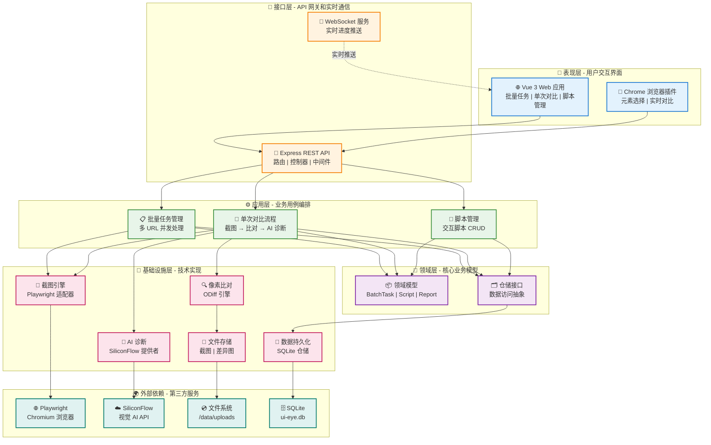
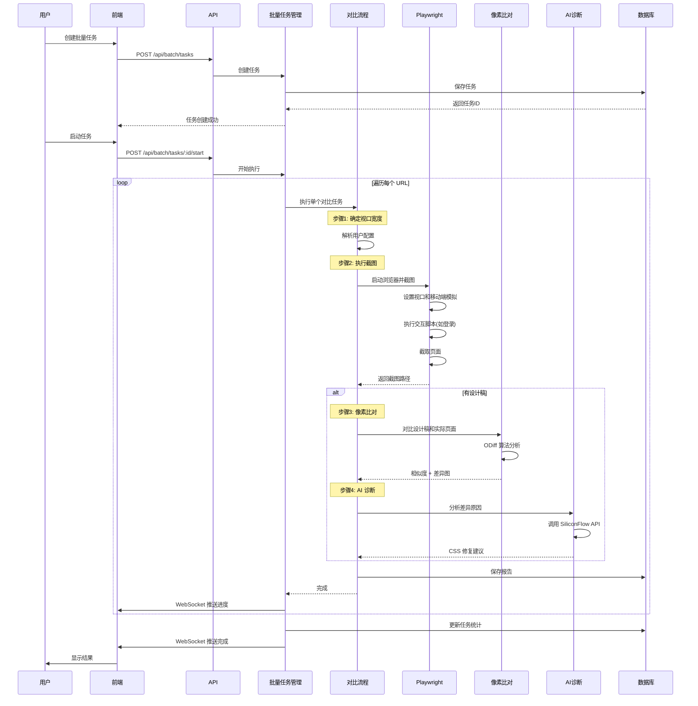
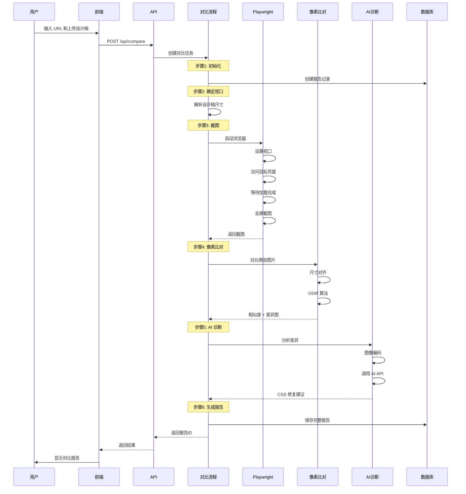
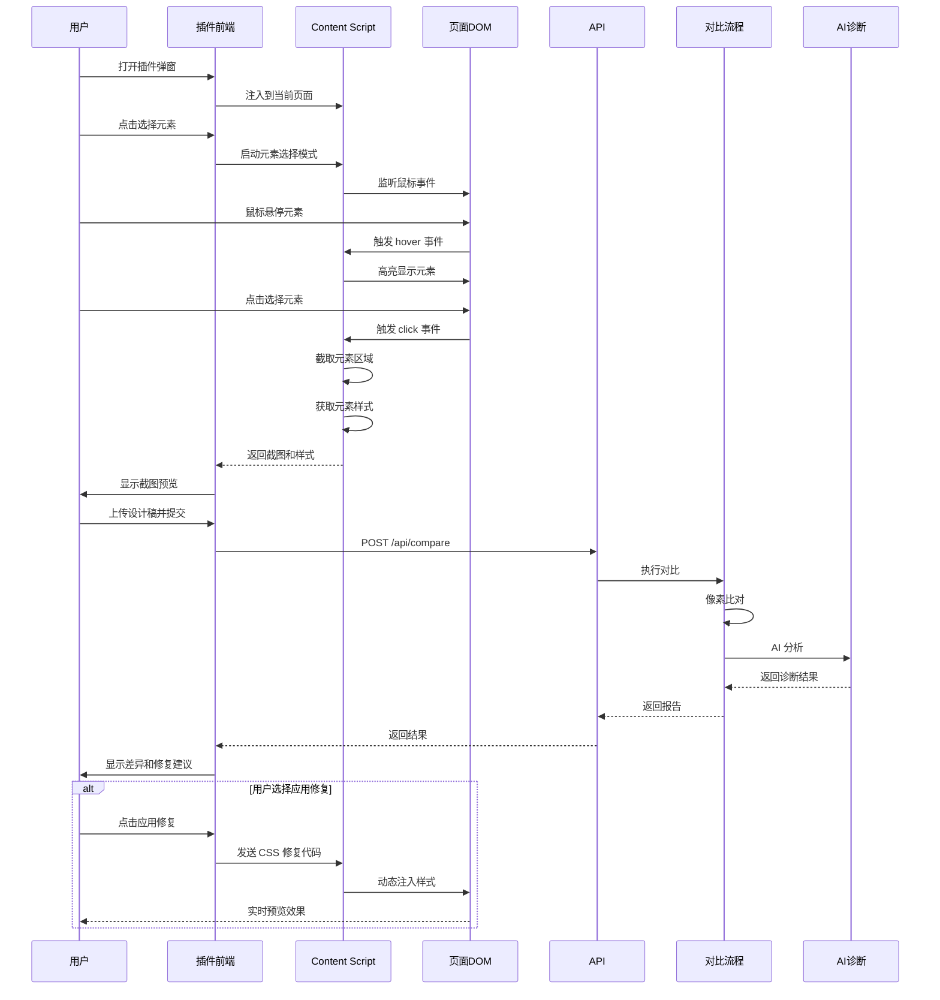

# UI-Eye 项目架构文档

## 📋 项目概述

UI-Eye 是一个基于 AI 的视觉回归测试平台，支持批量截图、像素级比对、AI 诊断和交互脚本执行。

---

## 🏗️ 系统架构（分层视图）



---

## 🔄 批量任务执行流程



---

## � 单次对比任务执行流程



---

## 🔌 浏览器插件执行流程



---

## 📁 项目目录结构

```
UI-Eye/
├── server/                          # 后端服务
│   ├── src/
│   │   ├── app.ts                   # Express 应用入口
│   │   ├── index.ts                 # 服务器启动引导
│   │   ├── controllers/             # 控制器层
│   │   │   ├── BatchController.ts
│   │   │   └── ScriptController.ts
│   │   ├── routes/                  # 路由定义
│   │   │   ├── batchRoutes.ts
│   │   │   └── scriptRoutes.ts
│   │   ├── application/             # 应用层 (Use Cases)
│   │   │   └── tasks/
│   │   │       ├── ManageBatchTasksUseCase.ts
│   │   │       ├── RunCompareUseCase.ts
│   │   │       └── ManageScriptsUseCase.ts
│   │   ├── domain/                  # 领域层
│   │   │   ├── models/
│   │   │   │   ├── BatchTask.ts
│   │   │   │   ├── Script.ts
│   │   │   │   └── Report.ts
│   │   │   └── repositories/
│   │   │       ├── IBatchTaskRepository.ts
│   │   │       └── IScriptRepository.ts
│   │   ├── infrastructure/          # 基础设施层
│   │   │   ├── adapters/
│   │   │   │   └── PlaywrightCaptureAdapter.ts
│   │   │   ├── engines/
│   │   │   │   └── ODiffCompareEngine.ts
│   │   │   ├── ai/
│   │   │   │   └── SiliconFlowAIProvider.ts
│   │   │   ├── repositories/
│   │   │   │   ├── SqliteBatchTaskRepository.ts
│   │   │   │   └── SqliteScriptRepository.ts
│   │   │   ├── di/
│   │   │   │   └── Container.ts     # 依赖注入容器
│   │   │   └── ws/
│   │   │       └── WSServer.ts      # WebSocket 服务
│   │   ├── db/
│   │   │   ├── connection.ts        # 数据库连接
│   │   │   └── schema.ts            # 数据库 Schema
│   │   └── utils/
│   │       └── PathUtils.ts
│   └── data/
│       └── uploads/                 # 截图存储目录
├── web/                             # 前端应用
│   ├── src/
│   │   ├── ui/
│   │   │   └── views/
│   │   │       ├── BatchScreenshot.vue
│   │   │       ├── BatchTaskDetail.vue
│   │   │       └── ScriptManagement.vue
│   │   └── api/
│   │       └── batchTask.ts
│   └── vite.config.ts
├── extension/                       # 浏览器插件
│   ├── popup.html
│   └── content.js
└── docs/                            # 文档
    ├── INTERACTIVE_SCRIPTS.md       # 交互脚本指南
    ├── USER_GUIDE.md
    └── ARCHITECTURE.md              # 本文档
```

---

## 🔧 核心组件说明

### 1. PlaywrightCaptureAdapter

**职责**：使用 Playwright 执行页面截图和脚本注入

**关键功能**：
- 启动无头浏览器
- 设置视口和移动端模拟
- 执行交互脚本（登录、清除弹窗等）
- 截取全屏或指定区域

**代码位置**：`server/src/infrastructure/adapters/PlaywrightCaptureAdapter.ts`

### 2. ManageBatchTasksUseCase

**职责**：批量任务的生命周期管理

**关键功能**：
- 创建批量任务
- 并发执行多个 URL 的截图和比对
- 实时进度广播（WebSocket）
- 任务统计和聚合

**代码位置**：`server/src/application/tasks/ManageBatchTasksUseCase.ts`

### 3. RunCompareUseCase

**职责**：单个 URL 的完整比对流程

**关键功能**：
- 截图捕获
- 像素级比对
- AI 诊断
- 报告生成

**代码位置**：`server/src/application/tasks/RunCompareUseCase.ts`

### 4. ODiffCompareEngine

**职责**：像素级图像比对

**关键功能**：
- 尺寸对齐
- ODiff 算法比对
- 差异图生成
- 相似度计算

**代码位置**：`server/src/infrastructure/engines/ODiffCompareEngine.ts`

### 5. SiliconFlowAIProvider

**职责**：AI 视觉诊断

**关键功能**：
- 调用 SiliconFlow API
- 图像编码和上传
- 差异分析
- 修复建议生成

**代码位置**：`server/src/infrastructure/ai/SiliconFlowAIProvider.ts`

---

## 🗄️ 数据库 Schema

### batch_tasks 表

| 字段           | 类型    | 说明                            |
| -------------- | ------- | ------------------------------- |
| id             | INTEGER | 主键                            |
| name           | TEXT    | 任务名称                        |
| urls           | TEXT    | URL 列表（JSON）                |
| status         | TEXT    | 任务状态                        |
| compare_config | TEXT    | 比对配置（JSON，包含 viewport） |
| script_id      | TEXT    | 关联的交互脚本 ID               |
| created_at     | INTEGER | 创建时间                        |

### scripts 表

| 字段        | 类型    | 说明                |
| ----------- | ------- | ------------------- |
| id          | TEXT    | 主键                |
| name        | TEXT    | 脚本名称            |
| code        | TEXT    | Playwright 脚本代码 |
| description | TEXT    | 脚本描述            |
| created_at  | INTEGER | 创建时间            |

---

## 🔌 依赖注入容器

使用单例模式管理所有服务的生命周期：

```typescript
Container.getBatchTaskRepository()
Container.getScriptRepository()
Container.getCaptureAdapter()        // PlaywrightCaptureAdapter
Container.getCompareEngine()         // ODiffCompareEngine
Container.getAIProvider()            // SiliconFlowAIProvider
Container.getManageBatchTasksUseCase()
Container.getRunCompareUseCase()
```

**代码位置**：`server/src/infrastructure/di/Container.ts`

---

## 🌐 API 端点

### 批量任务

- `POST /api/batch/tasks` - 创建批量任务
- `POST /api/batch/tasks/:id/start` - 启动任务
- `GET /api/batch/tasks/:id` - 获取任务详情
- `GET /api/batch/tasks` - 获取任务列表

### 交互脚本

- `POST /api/batch/scripts` - 创建脚本
- `GET /api/batch/scripts` - 获取脚本列表
- `GET /api/batch/scripts/:id` - 获取脚本详情
- `PUT /api/batch/scripts/:id` - 更新脚本
- `DELETE /api/batch/scripts/:id` - 删除脚本

---

## 🔄 WebSocket 实时通信

**端点**：`ws://localhost:3000`

**事件类型**：
- `task:started` - 任务开始
- `task:progress` - 任务进度更新
- `task:completed` - 任务完成

**数据格式**：
```json
{
  "taskId": 123,
  "type": "task:progress",
  "data": {
    "current": 5,
    "total": 10,
    "progress": 50,
    "currentUrl": "https://example.com"
  }
}
```

---

## 🎨 设计模式

### 1. 领域驱动设计 (DDD)

- **Domain Layer**: 业务模型和接口定义
- **Application Layer**: 用例编排
- **Infrastructure Layer**: 技术实现

### 2. 依赖注入 (DI)

- 使用 Container 管理依赖
- 接口与实现分离
- 便于测试和替换

### 3. 适配器模式

- `PlaywrightCaptureAdapter` 实现 `ICaptureAdapter`
- 可轻松切换截图引擎

### 4. 仓储模式

- `SqliteBatchTaskRepository` 实现 `IBatchTaskRepository`
- 数据访问逻辑封装

---

## 🚀 技术栈

### 后端
- **Node.js** + **TypeScript**
- **Express** - Web 框架
- **Playwright** - 浏览器自动化
- **SQLite** - 数据库
- **WebSocket** - 实时通信
- **Sharp** - 图像处理
- **ODiff** - 像素比对

### 前端
- **Vue 3** - UI 框架
- **Vite** - 构建工具
- **Axios** - HTTP 客户端

### AI
- **SiliconFlow** - 视觉 AI 分析

---

## 📊 性能优化

1. **并发控制**：使用 `p-limit` 限制并发数（默认 3）
2. **懒加载**：依赖注入容器使用懒加载
3. **WebSocket**：实时进度推送，减少轮询
4. **图像优化**：使用 Sharp 进行高效图像处理

---

## 🔐 安全考虑

1. **脚本执行**：动态执行用户脚本需要安全审查
2. **Cookie 存储**：建议使用环境变量存储敏感信息
3. **API 认证**：生产环境需添加认证机制
4. **输入验证**：前端和后端双重 URL 格式校验

---

## 📚 相关文档

- [交互脚本使用指南](./INTERACTIVE_SCRIPTS.md)
- [用户手册](./USER_GUIDE.md)
- [测试文档](./TESTING.md)
